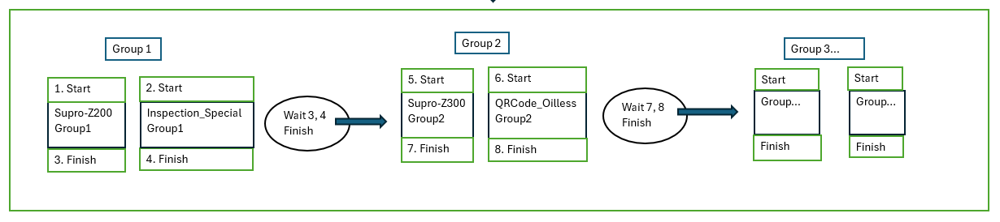

### Sơ đồ giải thích cách App Center hoạt động

</br>Chia các App vào các group, Group này xong thì tiếp đến group khác
### Thứ tự hoạt động
    + Khi mở App sẽ chạy Control.SetUp (hàm SetUp ở Control.cs) các App đã SetUp Combo cho máy ( nếu đã có combo thì sẽ mở các app trong combo đó)
	+ Khi mà nhập xong PO và nhấn Enter, App sẽ chạy hàm Control.Run_Flow 
	+ Run_Flow sẽ chạy như hình trên mô tả, mở và start tất cả app ở group sau đó chờ finish tất cả sẽ start tiếp các app ở group tiếp theo
### Dùng TaskCompletionSource</bool/> để chờ các app nhỏ finish
#### Ví dụ Supro Z-200 và Inspection_Standard ở Group 1 như hình trên. Sẽ dùng TaskCompletionSource</bool/> tcs_Supro_Z200 = new TaskCompletionSource</bool/>() và TaskCompletionSource<bool> tcs_KJapaneseG = new TaskCompletionSource<bool>(); </br></br>
1. Khi start Supro và Inspection_Standard sẽ khởi tạo 1 tcs_Supro_Z200 và tcs_KJapaneseG mới và đưa 2 tcs này vào GlobalVariables.List_tasks</br> 
2. Dùng await Task.WhenAll(GlobalVariables.List_tasks); để chờ các tcs trong GlobalVariables.List_tasks hoàn thành. Một tcs hoàn thành (tcs.SetResult(true)) khi sự kiện finish gắn cho đối tượng ở hàm Control.RunApp được gọi;
</br>Ví dụ: Ở app Inspection_Standard (kJapaneseObj)
```csharp
-------------------------------------------------------------------------------------------------------------------------------
+ Trong Control.RunApp:
Action<App, TaskCompletionSource<bool>> finishHandler = null;
finishHandler = (Obj, tcs) =>// Sự kiện Finish của App
{
    if (!tcs.Task.IsCompleted)
    {
        opF.Invoke(new Action(() =>// đưa các code làm thay đổi UI ra luồng chính
        {
            buttons[i].BackColor = Color.White;
            buttons[i].Text = buttons[i].Text + ": Finished";
            Debug.Print("label Đã Finish");
        }));
        tcs.SetResult(true); // Set Finish Task của App
        Obj.Finished -= finishHandler; 
    }
};
...
...
if (obj is KJapaneseG)
            {
                kJapaneseObj = (KJapaneseG)obj;
                GlobalVariables.tcs_KJapaneseG = new TaskCompletionSource<bool>();//khởi tạo Task của App
                kJapaneseObj.SetUp_KJapaneseG(txt_MaNV.Text,txt_PO.Text); // SetUp App
                kJapaneseObj.Canceled -= cancelHandler;
                kJapaneseObj.Finished -= finishHandler;
                kJapaneseObj.Canceled += cancelHandler;
                kJapaneseObj.Finished += finishHandler;
                GlobalVariables.List_tasks.Add(GlobalVariables.tcs_KJapaneseG.Task);// đưa task vào List_task
                result = kJapaneseObj.Start_Star(); // start_app

            }
-------------------------------------------------------------------------------------------------------------------------------
+ Trong Inspection_Standard (KJapaneseG)
internal class KJapaneseG : App
{
    public event Action<App, TaskCompletionSource<bool>> Finished;// code này trong class cha (App)
    public bool Start_Star( )
    {
        OpenStar();
        IntPtr h = ShowStar();
        if (h == IntPtr.Zero){
            return false;
        }try{
            Fill_Star(MANV,PO, h);
        }catch { }

        Finished?.Invoke(this,GlobalVariables.tcs_KJapaneseG); 
        return true;
    }
}
-------------------------------------------------------------------------------------------------------------------------------
    Trong Control.RunApp sẽ tạo một đối tượng kJapaneseOb, khởi tạo mới 1 tcs GlobalVariables.tcs_KJapaneseG. Sau đó đưa tcs này vào List_tasks và gắn sự kiện finishHandler vào đối tượng kJapaneseObj
    Ở Inspection_Standard, sau khi Fill_star xong nó sẽ gọi sự kiện Finish (Finished?.Invoke(this,GlobalVariables.tcs_KJapaneseG)) để tcs.SetResult(true) là đã finish app này;
-------------------------------------------------------------------------------------------------------------------------------
    Tương tự KJapaneseG các app khác cũng sẽ có gọi Finished?.Invoke(this,GlobalVariables.tcs_...) để finish, tùy vào app đó finish như nào mà ta gọi sự kiện Finished
ví dụ như Supro sẽ finish khi người dùng click button POFinish trên web, hay app intem QRCode_Oilless_MANUFA sẽ Finish khi in đủ số lượng tem
    Khi các App trong Group Finish xong thì await Task.WhenAll(GlobalVariables.List_tasks) sẽ chạy xong và tiếp tục đến group khác
```


3. Sau khi hoàn thành sẽ có thể tiếp tục chạy group tiếp theo

### Thêm 1 app mới vào App Center:
	+ Thêm tên app mới vào bảng F2_ControlApp_Name trên cơ sở dữ liệu
	+ thêm class của app tương tự các app còn lại, có đầy đủ setup, start,...
	+ Thêm tcs token bên GlobalVariable class
	+ Nếu có cần bắt click chuột thì thêm vào mousehook bên GlobalVariable class
	+ Thêm vào trong hàm SetupApp, RunApp, SetTaskCancel, CheckTask ở Control.cs

### Bắt sự kiện click POFinish trên App Supro

+ Khi người dùng nhấn POFinish ở Supro. web sẽ gửi 1 Post Request tới url có bắt đầu bằng "http://10.4.24.117:8441/sp/Processing". Chỉ cần lấy được data gửi đi trong phương thức và xem biến hidUpdListControl có value == POFinish không là sẽ bắt được sự kiện click POFinish
```csharp
public void checkFinishWhenClick(int value, IPage page)
{
    // Check Form đếm giờ của Supro có hiện lên ko, đề phòng lỗi
    if ( GlobalVariables.tf_Process.Visible) // Có hiện lên
    {
        GlobalVariables.tf_Process.Invoke(new Action(() =>
        {
            try
            {
                GlobalVariables.tf_Process.Close(); // đóng form
            }
            catch { }


        }));
    }

    // Mở form đếm giờ
    GlobalVariables.tf_Process = new TimeForm(value);
    GlobalVariables.tf_Process.Show();
    GlobalVariables.tf_Process.setProcess("Supro - Qty: " + value);


    int numsClick = 0;// Check số lần Click vào button POFinish
    EventHandler<PuppeteerSharp.RequestEventArgs> requestHandler = null; // lắng nghe request
    EventHandler<PuppeteerSharp.ResponseCreatedEventArgs> response = null;// lắng nghe reponse


    // reponse này mình sẽ lấy Validity của PO trên Supro gán vào biến Value
    response = async (sender, e) => 
    {
        if (e.Response.Url.StartsWith("http://10.4.24.117:8441/sp/Processing"))
        {
            //value = await getValidityCnt(page);
            try
            {
                var body = await e.Response.TextAsync();

                // Sử dụng Regex để trích xuất giá trị validityCnt
                var validityCnt = Regex.Match(body, @"<span[^>]*id=""lblvalidityCnt""[^>]*>(\d+)</span>");

                if (validityCnt.Success)
                {

                    value = int.Parse(validityCnt.Groups[1].Value);

                }
            }
            catch {  }

        }
    };
    // lắng nghe sự kiện request
    requestHandler = async (sender, e) =>
    {
        var requestUrl = e.Request.Url;
        var method = e.Request.Method;

        if (requestUrl.StartsWith("http://10.4.24.117:8441/sp/Standby") && method.ToString().ToUpper() == "GET")
        {
            if (numsClick == 1 && value > 0)// Đã click vào button POFinish và có Validity Number > 0
            {
                Finish_App(tcs);
            }
            else
            {
                Cancel_App(tcs);
            }
            page.Request -= requestHandler;
            page.Response -= response;

            GlobalVariables.tf_Process.Invoke(new Action(() =>// đóng form đếm giờ
            {
                try
                {
                    GlobalVariables.tf_Process.Close();
                }
                catch { }
                

            }));
        }
        else if (requestUrl.StartsWith("http://10.4.24.117:8441/sp/Processing"))
        {
            string body = "";
            try
            {
                body = e.Request.PostData; // lấy data trogn phương thức post 
            }
            catch { }

            // lấy giá trị trường hidUpdListControl trong data
            string rs = gethidUpdListControl(body);
            if (rs == "POFinish")// nêu giá trị = POFinish thì ng dùng đã click vào button POFinish
            {
                numsClick = 1; // numsClick = 1
            }
        }
    };
    page.Response += response;
    page.Request += requestHandler;
}
```


### Các Nuget chính sử dụng
+ PuppeteerSharp: Điểu khiển chrome. Setup chrome ở chế độ remote debugging 
+ Interop.UIAutomationClient: để điền dữ liệu vào các text box hoặc click button trong các app con
+ Microsoft.Office.Interop.Excel: Nhập dữ liệu vào app Excel in tem
+ Còn có các nudget khác nhưng ko quan trọng.

### Có thể dùng code CaptureItemHandle.cs kết hợp Spy++ để lấy handle của control trong app con
 Ví dụ:
 CaptureItemHandle.GetControlHandle(IntPtr rH, string caption, string classname, int stt)
 Hàm này để lấy Handle, Caption,.. được gom lại hết trogn struct tự định nghĩa là WindowInfo trong Struct.cs
 sử dụng: CaptureItemHandle.GetControlHandle(h1, "In tem QRCode", "WindowsForms10.Window.b.app.0.13965fa_r8_ad1", 0);
 + với h1 là handle của app con
 + "In tem QRCode" là caption của control
 + "WindowsForms10.Window.b.app.0.13965fa_r8_ad1" là class của control
 + 0 là Stt của class và caption đó trong spy++